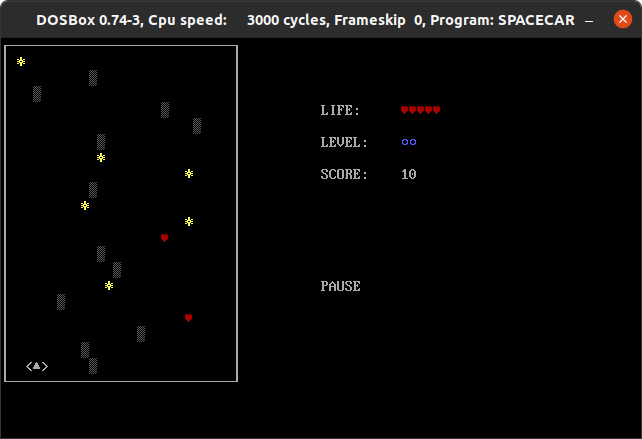

# SPACECAR

A DOS videogame written in assembly language. I developed it for an exam at University in 2008.

## Commands

- `Enter`: start
- `P`: pause
- `ESC`: Exit game
- `Arrow left/right`: move left/right
- `Arrow up/down`: change level (increase/decrease speed)

## Install dosbox

- Linux: `sudo apt install dosbox`
- Windows & Mac: https://www.dosbox.com/download.php?main=1
- Download **MASM** suite for dosbox (please, search it on Google)

## Preparation

- Open **dosbox**
- Prepare a folder containing `MASM`, `LINK` and your `SPACECAR.ASM` files
- Mount the folder on **C:** drive: `mount c /home/daniel/dosbox/8086`

## Compile & Run

- `MASM SPACECAR.ASM`: it creates the object file
- `LINK SPACECAR.OBJ`: it create the EXE file
- `SPACECAR.EXE`: it runs the videogame

## Useful DOS commands

- `KEYB IT`: change keyboard layout

## Virtualbox version

- Install `VirtualBox`
- Install `MS-DOS 6.22`
- Install `MASM 6.11`
- Install `LINK`

## Next steps

- Webassembly (?)
